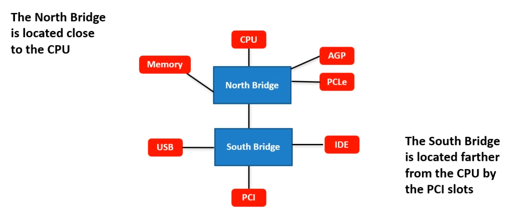

# 02_Connectors and Ports

[Connectors and Ports 👉VIDEO &#128279;](https://alison.com/topic/learn/84189/topic-a)

- Function of motherboards
- Locaton of primary components

### Front adn Side Panels

- Audio connections
- Drive activity light
- Power light
- On/off button
- USB connections

### Cache Memory

- Cache memory
- Level I
- Level II
- Level III

### RAM Slots

- RAM slots
- Memory slots and sockets
- DIMM

### BIOS Chip

- Basic input/output system BIOS Chips
- ROM

### Expansion Slots

- Expansion slots
- Bus architecture
  - PCI
  - PCMICA
  - AGP
  - PCI-X
  - PCI Express
  - AMR
  - CNR

### Connectors and Ports

- Keyboard
- Mouse
- Serial 1
- Serial 2
- USB
