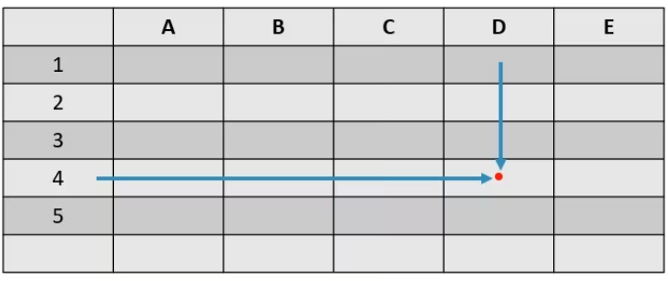

# 01_Unerstanding Processors

[Unerstanding Processors 👉VIDEO &#128279;](https://alison.com/topic/learn/84191/topic-a)

- [ ] Data Bus
  - Transfers data in the form of bits
- [ ] Address Bus

  - Uses a read/write system which is referenced by location
    - When storing information into system memory, the processor provides a location address with the information that is stored.

- In this diagram, the data would be stored in location D4

  

- [ ] It is important to be familiar with processors and related terminology
- [ ] Processor speeds
  - Teh speed at which a processor executes instructions and commands
  - Megahertz and gigahertz

# Architecture

- [ ] **Registers :** are storage areas within the processor used for temporarily storing data for future manipulation
- [ ] **Cache memory :** is information stored in the processors high-speed memory
- [ ] **Virtualization :** virtual machines run separate operating systems with virtual resources
- [ ] **Graphics Processing Unit (GPU) :** provides video calculations and processing of graphic applications
- [ ] **Throttling :** the CPU reduces processing speed when it senses overheating
- [ ] **Overclocking :** causing a piece of hardware to run faster than the rated speed

# Chip Packaging

- [ ] **Chip Packaging :** how a computer chip is constructed and delivered to the consumer
  - Shape and form
  - Dual in-line package (DIP) chip
  - Pin grid array (PGA) chip
  - Land grid array (LGA) chip
  - Single edge contact (SEC) chip

# Processor Sockets

- [ ] Socket types

  - Compatibility
  - Determine what sockets exist
  - Purchase a the CPU sockets
  - Match the voltage of the board
  - Sockets are labeled by type along the side of the socket

- [ ] countless processor socket types and slots
  - [CPU Socket Lists &#128279;](https://en.wikipedia.org/wiki/CPU_socket)

# Intel and Non-Intel Chips

- [ ] **Clock multiplying :** the processor will run faster than the motherboard
- [ ] The motherboard speed is as important as the advertised speed of a processor

| Processor    | Motherboard speed in (MHZ) | Multiplier | Processor speed (MHz) |
| ------------ | -------------------------- | ---------- | --------------------- |
| Pentinum 90  | 60                         | 1.5        | 90                    |
| Pentinum 100 | 66                         | 1.5        | 99                    |
| Pentinum 100 | 60                         | 2.5        | 150                   |

# Additional Core Processors

- [ ] Pentium Pro - Included dynamic execution
  - Multiple branch prediction
  - Dataflow analysis
  - Speculative execution
- [ ] Pentium II, III, 4, M
- [ ] Celeron
- [ ] Intel core 2, Atom, i3/i5/i7
- [ ] Athlon
- [ ] Turion

# Installing a Processor

- [ ] Determine the socket type
  - Will it fit in the socket?
- [ ] CPU voltage
- [ ] Performing installation
- [ ] Processor cooling
