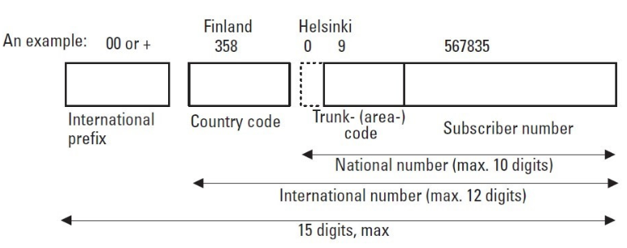

# 01_Network Communication

[Network Communication &#128279;](https://alison.com/topic/learn/145589/network-communication-learning-outcomes)

## Learning Outcomes

After completing this module, you will be able to:

- Define the term telecommunications along with the basic operation of a telecom network with a conventional telephone
- Identify the applications, characteristics, and distinctions between the various aspects of a telecom network
- Discuss the fundamental limitations and specifications for transmission tools utilized in the telecom core network
- Explain the overarching concept and functionality of cellular radio systems
- Describe the various components of data communication and the internet
- Summarize the architecture, function, and operation of the global system for mobile communication
- List the key applications and benefits offered by the telecommunication network industry

## What is Telecommunication?

- [ ] The process of transmitting electronic data over long distances is known as telecommunications.
  - [ ] Voice phone calls, data, text, pictures, and video are all examples of different types of information. Nowadays, telecommunications are utilized to connect relatively far-flung computer to network. computer control these networks directly.

# Basic Telecommunication Network

The basic purpose of a telecommunications network is to transmit user information in any form to another network user. These users of public networks, for example, a telephone network, are called subscribers. User information may take many forms, such as voice or data, and subscribers may use different access network technologies to access the network.

The three technologies needed for communication through the network are:

1. **Transmission**
2. **Switching**
3. **Signalling**

Each of these technologies requires engineering, operation, and maintenance specialists.

## Transmission

Transmission is transporting information between endpoints of a system or a network. Transmission systems use four basic media for information transfer from one point to another:

1. **Copper cables**, such as those used in LANs and telephone subscriber lines.
2. **Optical fibre cables**, such as high-data-rate transmission in telecommunications networks.
3. **Radio waves**, such as cellular telephones and satellite transmission.
4. **Free-space optics**, such as infrared remote controllers.

In a telecommunications network, the transmission systems interconnect exchanges and, taken together, these transmission systems are called the **transmission or transport network**.

# Operation of a Conventional Telephone

The ordinary home telephone receives the electrical power that it needs for operation from the local exchange via two copper wires. This subscriber line, which carries speech signals as well, is a twisted pair called a **local loop**. The principle of the power supply coming from the exchange site makes basic telephone service independent of the local electric power network.

Local exchanges have a **large-capacity battery** that keeps the exchange and subscriber sets operational for a few hours if the supply of electricity is cut off. This is essential because the operation of the telephone network is especially important in emergency situations when the electric power supply may be down.

---

## Microphone

When we raise the hook of a telephone, the on/off hook switch is closed and current starts flowing on the subscriber loop through the microphone that is connected to the subscriber loop. The **microphone converts acoustic energy to electrical energy**.

Originally, telephone microphones were **carbon microphones** that had diaphragms with small containers of carbon grains. They operated as variable resistors supplied with battery voltage from an exchange site.

When sound waves pressed the carbon grains more tightly, loop resistance decreased and current slightly increased. The variable air pressure generated a variable, alternating current to the subscriber loop. This variable currently contained voice information.

The basic operating principle of the subscriber loop is still the same today, although modern telephones include more sophisticated and better-quality microphones.

## Earphone

The alternating current, generated by the microphone, is converted back into voice at the other end of the connection. The earphone has a diaphragm with a piece of magnet inside a coil. The coil is supplied by alternating current produced by the microphone at the remote end of the connection. The current generates a variable magnetic field that moves the diaphragm that produces sound waves close to the original sound at the transmitting end.

## Signalling Functins

The microphone generates the electrical current that carries voice information, and earphone produces the voice at the receiving end of the speech circuit. The telephone netwrok provices a dialed up or circuit-switched service that enables the subscriber to initate and terminate calls. The subscriber dials the number to which she wants to be connected. This requires additional information transfer over the subscriber loop and from the exchange to other exchanges on the connection, and this transfer to additional information is called signaling. The basic subscriber signaling phases are described in the following section.

## Telephone Numbering

An international telephone connection from any telephone to any other telephone is made possible by the unique identification of each subscriber socket in the wrold. In mobile telephone netwroks, each telephone set (or subscriber card) has a unique identification number.

The numbering is hierarchical and has an intenationally standardized country code at the highest level. This makes national numbering schemes independent from each other. Image below specifies the structure of international telephone numbers.

