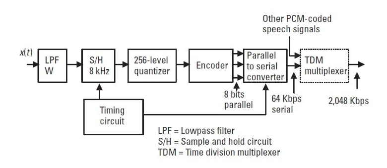

# 03\_

[03\_ &#128279;](https://alison.com/topic/learn/145591/signals-carried-over-the-network)

## Types of Communication

In telecommunications systems, the transmission of information may be unidirectional or bidirectional. The unidirectional systems that transmit in one direction only are called simplex, and the bidirectional systems that are able to transmit in both directions are called duplex systems. We can implement bidirectional information transfer with the half- or full-duplex transmission.

## Frequency and Bandwidth

The transmitted signal (the alteration of voltage or current) consists of multiple frequencies. The range of frequencies is called the bandwidth of the signal. The bandwidth is one of the most important characteristics of analog information and it is also the most important limiting factor for the data rate of digital information transfer.

## Signal & Systems

Numerous technologies produced information-carrying signals from analog signals. Both in terms of values and timing, these signals are continuous. As digital signals have become more prevalent, analog signals are being used less and less. To put it simply, analog signals are any signals that are generated organically or occur in nature.

Digital signals, in contrast to analog signals, are discrete in both value and time. These signals, which are made up of various voltage values, are represented by binary numbers.

## Advantages of Digital Technology

Analog systems in a telecommunications network have gradually been replaced with digital systems. The most important advantages of digital technology over analog technology are as follows:
|a ---|b --|
| ---| ---|
| Digital functions make a high scale of integration possible. | Digital technology results in lower cost, better reliability, less floor space, and lower power consumption. |
| Digital technology makes communication quality independent of distance. | Digital technology provides better noise tolerance. |
| Digital technology makes new services available. | The digital system provides high transmission capacity. |
| Digital networks offer flexibility. | Digital networks are ideal for growing data communication. |

## Network Singnals

- PCM
- Sampling
- Quantization
- Binary Coding

PCM is a standardized method that is used in the telephone network to change an analog signal to a digital one for transmission through the digital telecommunications network. The analog signal is first sampled at an 8-kHz sampling rate; then each sample is quantized into 1 of 256 levels and then encoded into digital eight-bit words. The overall data rate of one speech signal becomes 8,000 × 8 = 64 Kbps.

This same data rate is available for data transmission through each speech channel in the network. In the United States one bit of eight in every sixth frame is “robbed” for in-band signaling and the available transparent data capacity of a single speech channel in the network is reduced to 8,000 × 7 = 56 Kbps.

## PCM Encoder and Decoder

### PCM Encoding

The figure in the next tab presents a block diagram of a PCM encoder based on the European standard. Before actual encoding, the analog signal is filtered into the frequency band from 300 to 3,400 Hz. This bandwidth was defined to be acceptable for sufficient quality human voice so that the speaker can be recognized at the other end.

This filtering is mandatory to ensure that the sampling theorem is satisfied, that is, that the analog signal does not contain frequencies higher than half of the sampling frequency. Then the analog signal is sampled at an 8-kHz sampling frequency and the samples are nonlinearly coded into 8-bit words by a quantizer and an encoder. Words are then converted into serial form and multiplexed with other PCMcoded voice signals into a 2,048 Kbps primary rate signal that contains 30 voice channels.

## PCM Decoding

At the receiver, the demultiplexer separates 64-Kbps individual channels that are then converted into 8-bit parallel sample values, as shown in Figure in the next tab. Sample pulses are reconstructed and the resulting series is filtered to create a voice signal that closely resembles the original.

Gain and Loss in Decibels
Along the long-distance communication connection or channel, the power of the signal is reduced and amplified over and over again. The signal power needs to be rigidly controlled to keep it high enough in relation to background noise and low enough to avoid system overload and resulting distortion.

The reduction of signal strength, loss, or attenuation, is expressed in terms of power loss. When the signal is regained, this is expressed in terms of power gain. Thus the absolute gain of ten corresponds to a loss of 1/10.

The gain in decibels is defined as follows:

$$
g_{dB} + 10 \log_{10}(g) = 10 \log_{10}\left(\frac{P_{out}}{P_{in}}\right)
$$

If the output and input powers are the same, the absolute gain and loss both have values of 1 and the corresponding gain and loss in decibels are each 0 dB. If the gain is 10, the corresponding decibel value of gain is 10 dB. The loss is correspondingly 1/10, that is, equal to –10 dB. Thus, if the power is reduced, the gain in decibels results in a negative value.
